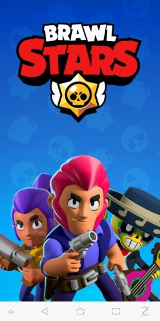
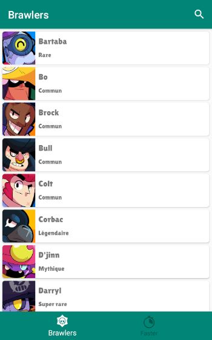
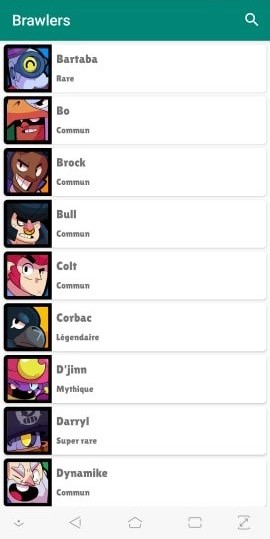

# Projet_Programmation_Mobile
## ESIEA, 3ème année (2018-2019)

## Présentation
Projet de programmation mobile Android ayant pour finalité la réalisation d'une application codé en Java, contenant deux écrans différents : l'un présentant une liste d'éléments et l'autre un descriptif de chacun de ces éléments de cette liste.

Cette application affiche les brawlers (personnages) du jeu BrawlStars à partir d'une API Rest (réalisé par moi-même) et hébergée sur bridge.buddyweb.fr.

## Prérequis

- Installation d'Android Studio.
- Création de l'API Rest.

## Consignes respectées :
- Deux écrans : Un écran avec une liste et un écran avec un détail de l’item de cette liste.
- Appel WebService à une API Rest.
- Stockage des données en cache.
- Fonctions supplémentaires :
  - Architecture MVC
  - Initiation à Gitflow (branche feature)
  - Écran d'introduction (SplashActivity)
  - Animation (fondu) entre l'écran Splash et l'écran d'accueil contenant la liste des éléments
  - Barre de recherche "dynamique" (SearchView & Toolbar)
  - Création d'une API Rest (bridge.buddyweb.fr)
  - Stockages en cache des données de l'API (sharedPreferences)
  - Implémentation de Fabric (Crash Analytics)
 
## Fonctionnalités :

### Écran d'introduction

- Splash affichant une pokeball.

### Écran d'accueil

- Affiche la liste des brawlers avec une barre de recherche.

   
