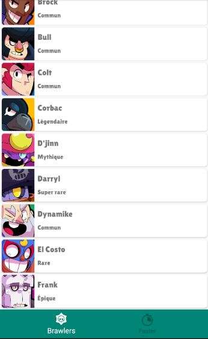

# Projet_Programmation_Mobile
## ESIEA, 4ème année (2019-2020)

## Présentation
Projet de programmation mobile Android ayant pour finalité la réalisation d'une application codé en Java, contenant deux écrans différents : l'un présentant une liste d'éléments et l'autre un descriptif de chacun de ces éléments de cette liste. 

Cette application affiche les brawlers (personnages) du jeu BrawlStars à partir d'une API Rest (réalisé par moi-même) et hébergée sur bridge.buddyweb.fr.

## Prérequis

- Installation d'Android Studio
- Création d'un compte GitHub
- Création de l'API Rest

## Consignes respectées :
- Deux écrans : Un écran avec une liste et un écran avec un détail de l’item de cette liste
- Appel WebService à une API Rest
- Stockages en cache des données de l'API (sharedPreferences)
- Architecture MVC
- Utilisation de Gitflow (branche feature)
- Mise en place des fragments à l'aide d'une barre de navigation inférieure
- Fonctions supplémentaires :
  - Écran d'introduction (SplashActivity)
  - Animation (fondu) entre l'écran Splash et l'écran d'accueil contenant la liste des éléments
  - Barre de recherche "dynamique" (SearchView & Toolbar)
  - Création d'une API Rest (bridge.buddyweb.fr)
  - Implémentation de Fabric (Crash Analytics)
  - Ajout de l'APK (chemin : app/src/main/java/com/example/myapplication)
 
## Fonctionnalités :

### Écran d'introduction

- Splash affichant un fond d'Écran BrawlStars.

### Écran d'accueil

- Affiche la liste des brawlers avec une barre de recherche.

   

- La barre de recherche est "dynamique" (elle disparaît lors du scroll vers le bas) :

- La barre de navigation inférieure personnalisée permet de sélectionner le fragment que l'on souhaite afficher. Voici le fragment "Faster" :

### Écran du détail du Brawler

- Affiche les caractéristiques du brawler sélectionné (rareté, points de vie, dégâts attaque primaire/super, vitesse). La couleur de l'image de fond change en fonction de la rareté du brawler sélectionné (commun, rare, ...) :

  

  
